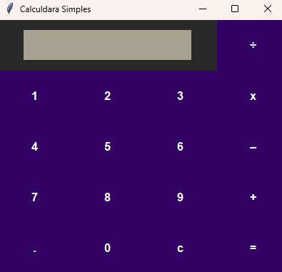

# Calculadora Simples em Python 

[](https://python.org)

Uma calculadora simples com interface gráfica desenvolvida em Python usando Tkinter.



##  Funcionalidades

- Operações básicas: adição, subtração, multiplicação e divisão
- Sistema de limpar tela (botão `C`)
- Design intuitivo com teclado numérico
- Cálculos imediatos com resultado no clique de `=`

##  Como Executar

1. Clone o repositório:
```bash
git clone https://github.com/seu-usuario/seu-repositorio.git
```
2. Acesse a pasta do projeto:
```bash
cd calculadora-python
```
3. Instale as dependências:
```bash
pip install -r requirements.txt
```
4. Execute a calculadora:
```bash
python calculadora.py
```
